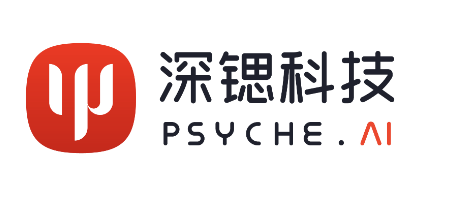

# CVCUDA_FaceStoreHelper
CVCUDA version of FaceStoreHelper, suitable for super-resolution, face restoration, and other face extraction and reattachment procedures.

[](LICENSE)

## Project Introduction

This project is designed to extract faces from images, perform image restoration/super-resolution operations, and then merge the restored face back into the original image. The code provides a simple, fast, and accurate method for face extraction and merging back into the original image, suitable for various application scenarios.

## Features

- Widely applicable for post-processing of face image super-resolution/restoration networks, such as GFPGAN and CodeFormer.

## Quick Start

### Install Dependencies

Before running this project, please make sure the following dependencies are installed: requirements.txt
cvcuda

### Usage Example

1. Clone this repository:

```bash
git clone https://github.com/your-username/your-repo.git
```

2. Enter the project directory:

```bash
cd your-repo
```

3. Run the script:

``` shell
python cvcuda_facestorehelper.py --input_path = your_images_path
```

4. The program will save the images with extracted faces in the specified path and draw the restored faces on the original images.

## Contribution

- If you encounter any problems, you can report them in this project's GitHub Issue.
- If you want to contribute code, please follow these steps:
  1. Clone this repository.
  2. Create a new branch:
     ```bash
     git checkout -b new-feature
     ```
  3. Make changes and commit:
     ```bash
     git commit -m 'Add some feature'
     ```
  4. Push to the remote branch:
     ```bash
     git push origin new-feature
     ```
  5. Submit a pull request.
  
## License

This project is licensed under the Creative Commons Attribution-NonCommercial 4.0 International License. Please read the [LICENSE](LICENSE) file for more information.

## Authors

Code contributor: Junli Deng, Xueting Yang, Xiaotian Ren

- Contact Author Name: Jason Zhaoxin Fan
- Contact  Author Email: fanzhaoxin@psyai.net
- Any other contact information: [psyai.com](https://www.psyai.com/home)

## Acknowledgments

This project incorporates the following methods:

1. **CVCUDA**: [Project Link](https://github.com/CVCUDA/CV-CUDA)

2. **GFPGAN**: [Project Link](https://github.com/TencentARC/GFPGAN)

3. **CodeFormer**: [Project Link](https://github.com/sczhou/CodeFormer)


## Invitation

We invite you to join [Psyche AI Inc](https://www.psyai.com/home) to conduct cutting-edge research and business implementation together. At Psyche AI Inc, we are committed to pushing the boundaries of what's possible in the fields of artificial intelligence and computer vision, especially their applications in avatars. As a member of our team, you will have the opportunity to collaborate with talented individuals, innovate new ideas, and contribute to projects that have a real-world impact.

If you are passionate about working on the forefront of technology and making a difference, we would love to hear from you. Please visit our website at [Psyche AI Inc](https://www.psyai.com/home) to learn more about us and to apply for open positions. You can also contact us by fanzhaoxin@psyai.net.

Let's shape the future together!!
